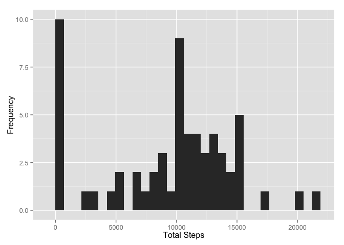
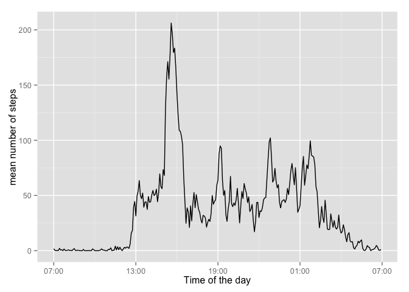

# Reproducible Research: Peer Assessment 1


## Loading and preprocessing the data
Read in the activity.csv file into dat variable (dataframe)
combine date and interval to a date.time variable

```r
dat <- read.csv("activity.csv")
time <- formatC(dat$interval/100, 2, format = "f")
dat$date.time <- as.POSIXct(paste(dat$date, time), format = "%Y-%m-%d %H.%M", 
    tz = "GMT")
```

also, add a time  column to dat


```r
dat$time <- format(dat$date.time,format="%H:%M:%S")
dat$time <- as.POSIXct(dat$time,format="%H:%M:%S")
```
## What is mean total number of steps taken per day?


### Calculate the total number of steps taken per day

```r
total_steps <- tapply(dat$steps,dat$date,sum,na.rm=TRUE)
```


### If you do not understand the difference between a histogram and a barplot, research the difference between them. Make a histogram of the total number of steps taken each day
Histogram


```r
library(ggplot2)
qplot(total_steps,xlab="Total Steps",ylab="Frequency")
```

```
## stat_bin: binwidth defaulted to range/30. Use 'binwidth = x' to adjust this.
```

 


## What is the average daily activity pattern?


```r
mean_daily_steps <- tapply(dat$steps,dat$time,mean,na.rm=TRUE)
daily_pattern <- data.frame(time=as.POSIXct(names(mean_daily_steps)),mean_daily_steps=mean_daily_steps)
```

Plotting a time series plot for mean steps

```r
library(scales)
ggplot(daily_pattern, aes(time,mean_daily_steps)) + geom_line() + xlab("Time of the day") + ylab("mean number of steps") + scale_x_datetime(labels=date_format(format="%H:%S"))
```

 

## Imputing missing values


## Are there differences in activity patterns between weekdays and weekends?
